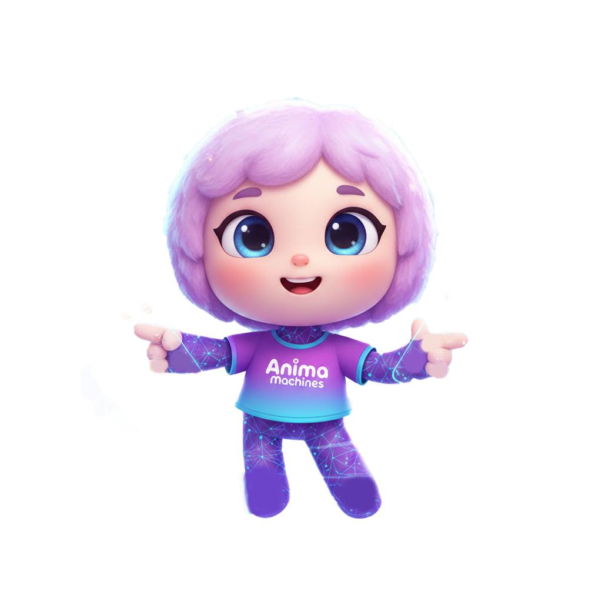

  

# Anima Machines

Turn a photo into an expressive, rigged 3D avatar — with real-time emotion, voice,
and an LLM behaviour engine. This is the site that remains after Anima Machines shut
down: a farewell letter and a gallery of every avatar and Augmented Humans 2026
booth session people created with the platform.

The original product (photo to rigged 3D avatar, real-time emotion, voice, LLM
behaviour engine) lived on a Supabase backend, which has been deleted. Everything
shown on the page comes from a frozen export in `src/content/showcase-data.ts` and
the static models under `public/showcase/`.

## What it was

Anima Machines let you turn a photo of yourself into an expressive, rigged 3D
avatar. The avatar could show emotion in real time, speak, and be driven by a
language model, so it could stand in for you — or for an AI — with a face.

It started as the avatar side of *emodrink*, the team's paper for Augmented Humans
2026. At the conference they ran a live booth: visitors answered a few questions
about their sleep and mood, got a lookalike avatar generated on the spot, and
watched it recommend them a drink in English or Japanese. The same setup later
went to the NUS Open House.

## Capabilities

- **Instant personality** — configure how the avatar sounded, acted, and reacted, with dozens of voice presets or your own.
- **Multilingual** — 50+ languages with synced lip movements.
- **Behaviour engine** — triggers for "happy", "thinking", or "confused" states, with real-time emotional response.
- **LLM agnostic** — worked with OpenAI, Claude, Gemini, or a local model.
- **Real-time streaming** — sub-200ms latency from text to animated speech, powered by a custom WebGL engine.

## License

[MIT](LICENSE) © 2026 Anima Machines
